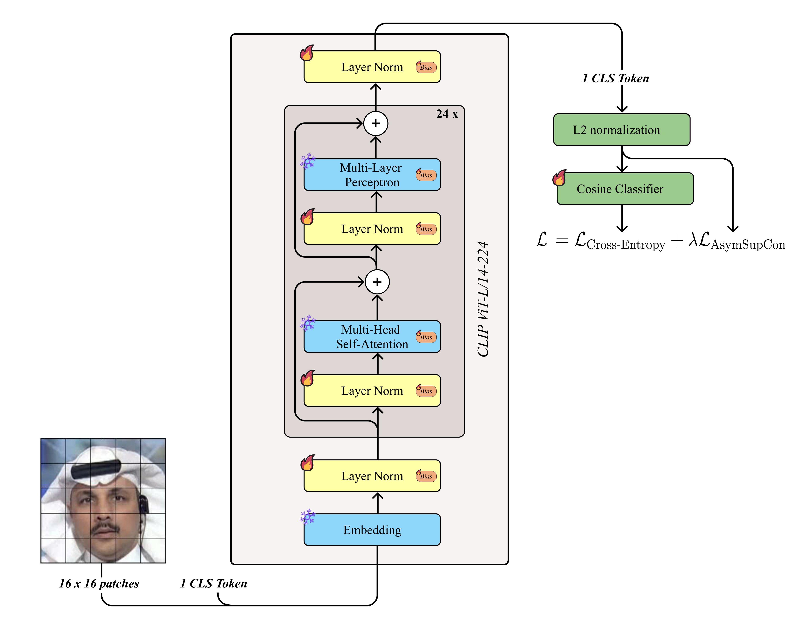
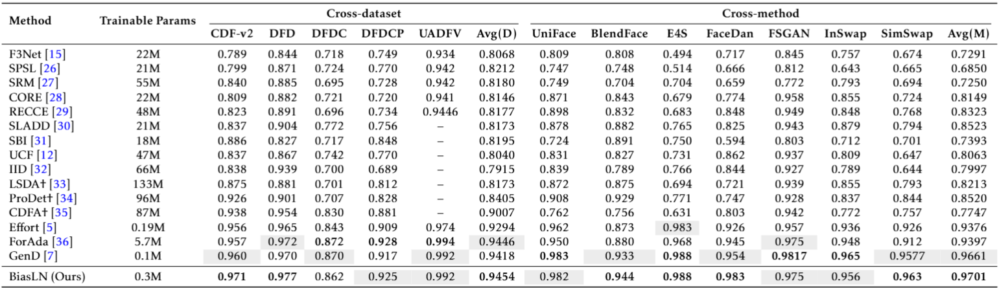

# BiasLN: Parameter-Efficient Deepfake Detection with Bias and LayerNorm Tuning

BiasLN is a parameter-efficient deepfake detection framework built on the [DeepfakeBench](https://github.com/SCLBD/DeepfakeBench) pipeline. It adapts CLIP ViT-L/14 visual representations by freezing the backbone and updating only lightweight components such as the classification head, LayerNorm parameters, and bias terms.

## Overview

Deepfake detectors often rely on large visual backbones, but full fine-tuning can be expensive and prone to overfitting when training data is limited or when evaluation involves unseen manipulation methods. BiasLN addresses this setting with a lightweight tuning strategy: it keeps the CLIP ViT-L/14 visual backbone fixed and updates only a small set of task-specific parameters.

This repository follows the [DeepfakeBench](https://github.com/SCLBD/DeepfakeBench)-style pipeline for dataset loading, preprocessing, training, testing, logging, and metric computation.

## Method

The main detector is registered as:

```yaml
model_name: biasln
```

Core implementation files:

- `training/detectors/biasln_detector.py`
- `training/config/detector/biasln.yaml`

BiasLN uses CLIP ViT-L/14 as the visual feature extractor. During training, the backbone is frozen by default. Only the following components are trainable:

- the binary classification head
- LayerNorm parameters in the visual backbone
- bias parameters in the visual backbone

This design substantially reduces the number of trainable parameters while preserving the strong general-purpose visual representation learned by CLIP.



## Repository Structure

```text
BiasLN/
|-- analysis/                 # Analysis and visualization utilities
|-- datasets/                 # Dataset-related files or placeholders
|-- figures/                  # Figures used in the paper/README
|-- preprocessing/            # Preprocessing scripts and configs
|-- training/                 # Training, testing, detectors, configs
|   |-- config/
|   |   `-- detector/
|   |       `-- biasln.yaml
|   `-- detectors/
|       `-- biasln_detector.py
|-- train.sh                  # Single-GPU training example
|-- dtrain.sh                 # Distributed training example
|-- test.sh                   # Testing / feature saving example
|-- install.sh                # Installation script
```

## Installation

Clone the repository:

```bash
git clone https://github.com/ducthinh4477/BiasLN.git
cd BiasLN
```

Create a conda environment:

```bash
conda create -n biasln python=3.8 -y
conda activate biasln
```

Install dependencies:

```bash
bash install.sh
```

## Dataset Download

BiasLN follows the [DeepfakeBench](https://github.com/SCLBD/DeepfakeBench) data interface. To reproduce experiments on standard deepfake datasets, users may download processed datasets from the [DeepfakeBench](https://github.com/SCLBD/DeepfakeBench) project, where preprocessing steps such as frame extraction and face cropping have already been completed.

For evaluation on more diverse manipulation methods, such as SimSwap, BlendFace, DeepFaceLab, and related fake-generation pipelines, users are encouraged to use the recently released [DF40](https://github.com/YZY-stack/DF40) dataset.

This repository does not redistribute those datasets. Please follow the dataset licenses and download instructions from the original providers.

## Dataset Placement

The training and testing code expects [DeepfakeBench](https://github.com/SCLBD/DeepfakeBench)-compatible RGB frames and JSON metadata. A typical layout is:

```text
BiasLN/
`-- datasets/
    |-- rgb/
    |   |-- FaceForensics++/
    |   |-- Celeb-DF-v2/
    |   |-- UADFV/
    |   |-- DFDCP/
    |   `-- DF40/
    `-- dataset_json/
        |-- FaceForensics++.json
        |-- Celeb-DF-v2.json
        |-- UADFV.json
        |-- DFDCP.json
        `-- DF40.json
```

An external storage layout is also supported:

```text
/path/to/data/
|-- rgb/
`-- dataset_json/
```

Update the configuration files to point to your data:

- `training/config/train_config.yaml`
- `training/config/test_config.yaml`
- `preprocessing/config.yaml`

The relevant fields in this repository are:

- `rgb_dir`: directory containing RGB face frames.
- `lmdb_dir`: directory for LMDB data if `lmdb: true` is used.
- `dataset_json_folder`: directory containing [DeepfakeBench](https://github.com/SCLBD/DeepfakeBench)-style JSON metadata.
- `preprocess.dataset_root_path`: root directory of raw datasets for preprocessing.
- `rearrange.dataset_root_path`: root directory of processed frames for JSON generation.
- `rearrange.output_file_path`: output directory for generated JSON metadata.

Make sure that dataset names passed through `--train_dataset` and `--test_dataset` match the dataset names represented by the JSON files.

## Preprocessing

### Case A: Using Processed DeepfakeBench / DF40 data

If you use already processed datasets from [DeepfakeBench](https://github.com/SCLBD/DeepfakeBench) or [DF40](https://github.com/YZY-stack/DF40), raw video preprocessing can be skipped. Place the `rgb/` frames and `dataset_json/` metadata in the expected locations, then update `rgb_dir` and `dataset_json_folder` in the train/test configuration files.

### Case B: Starting from Raw Videos

Configure the preprocessing settings:

```text
preprocessing/config.yaml
```

If the preprocessing pipeline requires dlib landmarks, place the landmark model under:

```text
preprocessing/dlib_tools/
```

Then run:

```bash
cd preprocessing
python preprocess.py
```

If JSON metadata is missing, generate it with:

```bash
python rearrange.py
```

Use absolute paths or paths that are correct relative to the repository root. Incorrect dataset names or JSON paths are the most common source of data-loading errors.

## Training

Single-GPU training example:

```bash
python training/train.py \
  --detector_path ./training/config/detector/biasln.yaml \
  --train_dataset "FaceForensics++" \
  --test_dataset "Celeb-DF-v2"
```

The same template is provided in:

```bash
bash train.sh
```

Arguments:

- `--detector_path`: path to the BiasLN detector configuration.
- `--train_dataset`: training dataset name.
- `--test_dataset`: validation/testing dataset name used during training.

Dataset names can be changed according to the JSON metadata available in `dataset_json_folder`.

By default, the training code uses `log_dir` from `training/config/train_config.yaml`. Checkpoints are saved by the trainer under:

```text
<log_dir>/<model_name>_<timestamp>/test/<dataset_name>/ckpt_best.pth
```

When `save_avg: true`, an averaged validation checkpoint may also be saved under:

```text
<log_dir>/<model_name>_<timestamp>/test/avg/ckpt_best.pth
```

## Distributed Training / Multi-GPU Training

The repository provides a 2-GPU distributed training example in `dtrain.sh`:

```bash
python3 -m torch.distributed.launch --nproc_per_node=2 training/train.py \
  --detector_path ./training/config/detector/biasln.yaml \
  --train_dataset FaceForensics++ \
  --test_dataset Celeb-DF-v2 \
  --ddp
```

A modern `torchrun` equivalent is:

```bash
torchrun --nproc_per_node=2 training/train.py \
  --detector_path ./training/config/detector/biasln.yaml \
  --train_dataset FaceForensics++ \
  --test_dataset Celeb-DF-v2 \
  --ddp
```

Here, `--nproc_per_node=2` means that two GPU processes are launched. To select specific GPUs:

```bash
CUDA_VISIBLE_DEVICES=0,1 torchrun --nproc_per_node=2 training/train.py \
  --detector_path ./training/config/detector/biasln.yaml \
  --train_dataset FaceForensics++ \
  --test_dataset Celeb-DF-v2 \
  --ddp
```

Adjust batch size in `training/config/detector/biasln.yaml` according to available GPU memory.

## Testing

Evaluation example:

```bash
python training/test.py \
  --detector_path ./training/config/detector/biasln.yaml \
  --test_dataset "Celeb-DF-v2" "UADFV" "DFDCP" \
  --weights_path /path/to/biasln_weights.pth \
  --save_feat \
  --feat_out_dir /kaggle/tmp/tsne_pkls
```

The same template is provided in:

```bash
bash test.sh
```

Arguments:

- `--weights_path`: path to the trained BiasLN checkpoint.
- `--test_dataset`: one or multiple datasets for evaluation.
- `--save_feat`: save extracted features for analysis and visualization.
- `--feat_out_dir`: output directory for saved feature pickle files.
- `--max_samples`: optional cap on the number of evaluated samples per dataset.

The checkpoint path depends on the configured `log_dir` and the dataset used during validation. After training, inspect the training log directory and the `test/<dataset_name>/ckpt_best.pth` files.

## Results

The following table summarizes the cross-dataset and cross-method results reported in the BiasLN paper.

<p align="center">
  
</p>
<p align="center"><em>Figure 1. Cross-dataset and cross-method evaluation of BiasLN.</em></p>

When reproducing the numbers, please make sure that the dataset splits, JSON metadata, test datasets, and checkpoint path match the experimental protocol used in the paper.

## Visualization / Feature Analysis

When `--save_feat` is enabled during testing, the script saves feature pickle files named:

```text
tsne_dict_<model_name>_<dataset_name>.pkl
```

These files can be used for representation analysis and visualization. Useful scripts in `analysis/` include:

- `analysis/tsne.py`: t-SNE visualization from saved feature files.
- `analysis/logits_decision_boundary.py`: logit and confidence distribution analysis.
- `analysis/curve_draw.py`: curve plotting utilities.
- `analysis/plot_curve.py`: metric curve plotting.
- `analysis/auc_table1_fromrecord.py` and `analysis/auc_table2_fromrecord.py`: AUC table generation from saved records.
- `analysis/heatmap_tab2.py`: heatmap visualization for tabulated results.
- `analysis/frequency.py`: frequency-domain analysis utilities.

Update file paths inside the analysis scripts to match your experiment outputs.

## Acknowledgement

This repository follows the [DeepfakeBench](https://github.com/SCLBD/DeepfakeBench)-style training and evaluation pipeline. We thank the [DeepfakeBench](https://github.com/SCLBD/DeepfakeBench) authors for releasing a standardized framework for deepfake detection research.

## Citation

If you use this repository, please cite the BiasLN paper once available. Until then, please also consider citing [DeepfakeBench](https://github.com/SCLBD/DeepfakeBench) when using the shared benchmark pipeline.
